# typing

タッチタイピング練習

## 手続き記憶

### 運動スキル学習における脳内経路の変化と記憶の固定
- 記憶:
    1. 宣言的記憶
        - 言葉やイメージで表現することのできる事実に関する記憶
        - 記憶の検索時に想起意識を伴う
        - 内側側頭葉（特に海馬）の関与が必須
        - 一回のエピソードでも成立しうる、忘却しやすい傾向がある
    2. 手続き記憶
        - 一定の認知活動や行動に組み込まれている記憶
        - 記憶の想起を意識的に行うよりも実際に行動した方が早い
        - 海馬依存ではないとされている
        - 習得までに反復トレーニングが必要だが、忘却しづらい傾向がある
        - 手続き記憶はさらに、認知スキルと運動スキルに分類される
            - 認知スキル: 読み書き計算等に関わる手続き記憶
            - 運動スキル: 身体運動を伴う手続き記憶

運動スキルの学習においては、スキル習熟前後で神経回路のシフトが起こるということが知られている

この神経回路シフトは時間経過とともに進行するとされ、ファースト・ラーニングとスロー・ラーニングの二層でとらえられるという仮設がKarniら（1998）により立てられている

ファースト・ラーニングはオンライン学習（顕在意識による学習）と言い換えることが可能で、脳内のスキャッフォルディング領域が使われると考えられている（Petersenら（1998））

この時点では、行動目標を「意識的に・ゆっくりと」遂行する必要がある

この段階の反復遂行では、一次運動野に一種の慣れ効果が起こるが。その後慣れ効果は見られなくなることが知られている

すなわちファースト・ラーニング段階の反復学習は、慣れが起こるまでは有効だが、それ以降の有効性はなくなると考えられている

この段階で、スロー・ラーニング層が有効化され、神経回路のシフトが起こり始める

スロー・ラーニングはオフライン学習（潜在意識による学習）と言い換えることが可能で、脳内の暗記プログラム（貯蔵領域）が使われると考えられている

この時点から、行動目標は「無意識的（身体的）に・すばやく」遂行することに変わる

これにより反復学習が再び有効となるが、ファースト・ラーニングの時とは異なり、短時間での反復は非効率的であり、ある程度の時間を置いた反復が効果的であるとされている

これは運動記憶の固定に関する問題であるためである

Walkerら（2002）によると、運動スキルの固定効果は睡眠（特にレム睡眠）の量と相関があるとされている

従って、スロー・ラーニングにおける記憶の固定は睡眠時間中に行われるのではないかと考えられている

またHuberら（2004）は、睡眠による運動記憶の固定が徐波睡眠と相関することを示した

一方でRobertsonら（2005）によると、睡眠による固定効果の本質はオフラインでの固定効果であることが示唆されており、スロー・ラーニング時の反復学習においては、睡眠の有無にかかわらず意識的な行動を抑制する（無意識的行動を強制する）ことでパフォーマンスが向上するという結果が得られた

ただし、顕在学習群においては短期的反復による慣れ効果と睡眠による記憶の固定のみが有効であり、オフラインによる記憶固定には効果がないという実験結果が得られている

まとめると、スキル学習初期においては意図をもって意識的な学習を行うことが有効である（意図優勢効果）が、慣れ効果がなくなるまで短期反復学習が行われた後は、無意識的・身体的な学習が有効化され、長期的反復によりスキル記憶が固定される

- 参考:
    - [橋本圭子 (2006) 運動スキル学習に関する考察](http://nirr.lib.niigata-u.ac.jp/bitstream/10623/20243/1/12_133-147.pdf)
    - [Karni A., et al. (1998) Proc Natl Acad Sci USA; 95(3); 861-8](https://www.ncbi.nlm.nih.gov/pubmed/9448252)
    - [Petersen SE., et al. (1998) Proc Natl Acad Sci USA; 95(3); 853-60](https://www.ncbi.nlm.nih.gov/pubmed/9448251)
    - [Walker MP., et al. (2002) Neuron; 35(1); 205-11](https://www.ncbi.nlm.nih.gov/pubmed/12123620)
    - [Huber R., et al. (2004) Nature; 430(6965); 78-81](https://www.ncbi.nlm.nih.gov/pubmed/15184907)
    - [Robertson EM., et al. (2005) Journal of Neuroscience; 25(27); 6372-6378](https://www.jneurosci.org/content/25/27/6372)

### 練習後エクササイズの有効性
新しい運動技術を習得したい場合、練習直後に15分程度のエクササイズ（単一有酸素運動）を行うのが有効であるという研究成果がある

エクササイズにより、脳の異なる領域を効率的に連携させ、脳神経の活性度を低く抑えることが可能となる

脳神経の活性度を低く抑えることで、潜在記憶領域を効果的に活用することができ、手続き記憶が上手く働くのではないかと考えられている

これはすなわち、スロー・ラーニング時のオフライン学習の効率を向上させるための研究結果である

- 参考:
    - [新しい運動技能のマスターには練習「後」エクササイズが有効](http://www.nibiohn.go.jp/eiken/linkdediet/news/FMPro%3F-db=NEWS.fp5&-Format=detail.htm&kibanID=64435&-lay=lay&-Find.html)
    - [Fabien Dal Maso, et al. (2018) NeuroImage; Volume 174; 380-392](https://www.sciencedirect.com/science/article/abs/pii/S1053811918302398?via%3Dihub)

### 10秒の小休憩で脳の処理が大幅アップ
生物学全般の学術誌『Current Biology』上で2019年3月28日に発表された、アメリカ国立衛生研究所（NIH）の研究によると、短時間の小休憩が学習効率の向上に重要であることが示された

実験では、27人の被験者に「数字を10秒間タイピング→ 10秒間休憩」を繰り返させ、脳波を調べたところ、タイピング中よりも休憩中のほうが脳の「前頭ー頭頂ネットワーク（FPN）」において「ベータ波の振動」が観測されたという

ここで、FPNは脳の集中の状態を示し、ベータ波は能動的で活発な思考や集中と関係している

つまり、この極めて短時間の休憩が、新しいスキルの習得において重要であることが示唆されたということである

なお「短時間の休憩がスキル習得に効果的である」というこの効果は、まだスキルが上達していない初期のみに発揮されるとのことである

すなわち、ファースト・ラーニング段階における短期反復学習時には、間に秒単位の小休憩を挟むことで慣れ効果が発揮されやすくなるということである

- 参考:
    - [「休憩なし」は本当に非効率。“たった10秒” 休むだけで学習が加速する。](https://studyhacker.net/skill-rest)
    - [Mariene Bonstrup, et al. (2019) Current Biology](https://www.cell.com/current-biology/fulltext/S0960-9822(19)30219-2)

### まとめ

