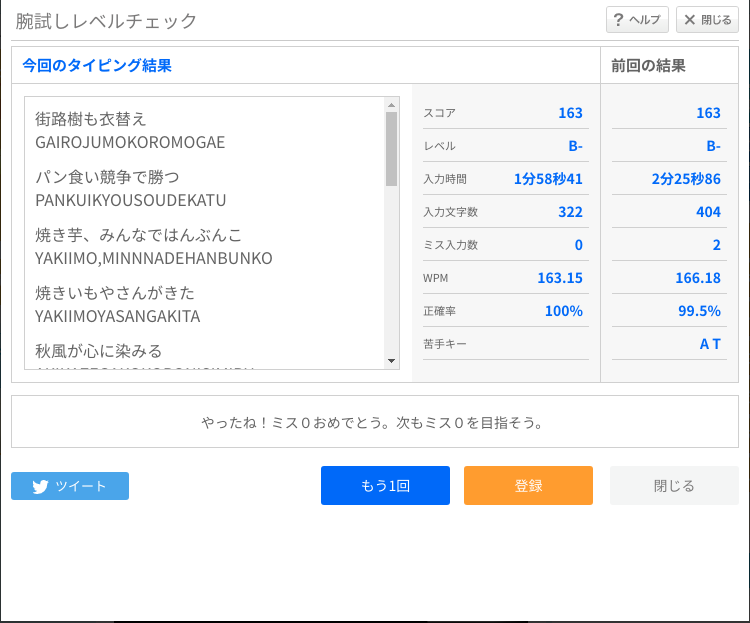

# タッチタイピング学習記録

## e-typing実習

[e-typing](https://www.e-typing.ne.jp/)の腕試しレベルチェックを実習

### 初回計測
まずは、以下の条件でどれくらいのキー入力速度があるのか確認

- 一切キーボードを見ない
- 打ち間違いのないよう十分にゆっくり意識的にキーを打つ
- 必ずホームポジションに戻ってからキーを打つ
- 最初に決めたタッチタイピング対応表に沿った指でキーを打つ

結果、キー入力速度は WPM: 163.15（キー／分）だった

秒単位に変換すると 2.72キー／秒 である

なお、タッチタイピングを開始した時点では、およそ 86キー／分（詳細データは紛失）だった

秒単位に変換すると 1.44キー／秒 だったため、その頃から考えると約2倍になっている

### 目標値
仕事で目標値として与えられたスコアは 300点 である

e-typingのスコア計算は $スコア = WPM \times 正解率$ であるから、正解率100％を絶対条件とすると、300キー／分（5キー／秒）を目標値として設定すれば良い
